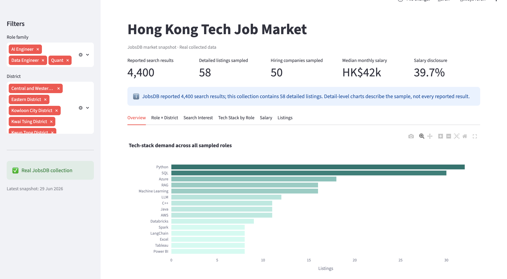

# Hong Kong Tech Job Market Dashboard

A Streamlit dashboard built with Polars and real, user-collected JobsDB CSV data.

## Dashboard preview



## Data layout

```text
data/raw/jobsdb_job_listings.csv
data/raw/jobsdb_search_snapshots.csv
        -> Polars cleaning
data/processed/jobsdb_listings_clean.csv
data/processed/jobsdb_search_snapshots_clean.csv
        -> Streamlit
```

Salary benchmarks live in `data/reference/salary_benchmarks.csv`; cached Google
Trends results live in `data/processed/google_trends.csv`.

## Run locally

```bash
uv sync
uv run hk-tech-job-market-dashboard process-jobsdb
uv run streamlit run app.py
```

Open <http://localhost:8501>.

To process JobsDB and refresh Google Trends together:

```bash
uv run hk-tech-job-market-dashboard all
```

The scraper writes to `data/raw/` by default. Existing raw CSVs are appended by
the scraper and read by the cleaning pipeline from the same paths.

## Quality checks

```bash
uv run ruff check .
uv run pytest
```

Search totals and collected job details have different grains. Advertised
salary statistics exclude listings without a valid disclosed range.
